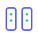
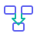

<div align="right">
  <a href="README.md">English</a> | <a href="README.zh-CN.md">简体中文</a> | <strong>日本語</strong>
</div>

<div align="center">
  <a href="https://nebutra.com">
    <picture>
      <source media="(prefers-color-scheme: dark)" srcset="packages/design/brand/assets/logo/logo-inverse.svg" />
      <source media="(prefers-color-scheme: light)" srcset="packages/design/brand/assets/logo/logo-horizontal-en.svg" />
      
    </picture>
  </a>
  <br />
  <br />
  <h3>オープンソース AI ネイティブ SaaS プラットフォーム基盤</h3>
  <p><em>AI ゲートウェイ、課金、認証、コンプライアンス、ホワイトラベル提供のためのガバナンス可能なマルチテナント基盤。</em></p>
  <br />
  <p>
    <a href="https://nebutra.com"><strong>公式サイト</strong></a> · 
    <a href="#概要"><strong>概要</strong></a> · 
    <a href="#技術スタック"><strong>技術スタック</strong></a> · 
    <a href="#クイックスタート"><strong>クイックスタート</strong></a> · 
    <a href="#コントリビュート"><strong>貢献</strong></a>
  </p>
  <p>
    <a href="https://github.com/Nebutra/Nebutra-Sailor/stargazers">
      
    </a>
    <a href="https://github.com/Nebutra/Nebutra-Sailor/network/members">
      
    </a>
    <a href="https://github.com/Nebutra/Nebutra-Sailor/blob/main/LICENSE">
      
    </a>
  </p>
</div>

<br />
<br />

## 概要

Nebutra Sailor は、ガバナンス可能なモダンなマルチテナントプラットフォームを構築するための、エンタープライズグレードの AI ネイティブ SaaS モノレポアーキテクチャです。AI ゲートウェイ、エージェントワークフロー、課金、認証、コンプライアンス、ホワイトラベル提供のための実用的な基盤を提供します。

Next.js 16、React 19、Prisma 7、Vercel AI SDK で構築され、AI をガバナンスが必要なランタイム能力として扱います。プロバイダートポロジー、モデルルーティング、可観測性、テナント分離、コンプライアンスフックがプラットフォーム基盤に含まれます。

### 会社について

<div align="center">
<h4>Nebutra Intelligence</h4>
  <sub>無錫雲毓智能科技有限公司</sub>
  <br /><br />
  <p>
    ガバナンス可能なプロダクト基盤を構築する AI ネイティブインフラ企業<br />
    マルチテナント SaaS、エージェントワークフロー、ローンチ運用、グローバル提供を支えます
  </p>
  <p align="center">長期的な堀はスターターではなく、変化し続ける AI 能力をガバナンス可能で出荷できるシステムに変える力です。</p>
</div>

> AI はデモの構築を助けます。Sailor はより難しい本番レイヤー、つまりガバナンス、セキュリティ、アーキテクチャ、スケーラビリティ、収益運用に焦点を当てます。
>
> 目的はウィザードでプロバイダーを一つずつ選ぶことではありません。プロバイダー、リージョン、テナント、コンプライアンス境界をまたいで進化できる AI トポロジーを運用することです。

<br />

<div align="center">
<table>
<tr>
<td align="center" width="25%">
  <h3>🚀</h3>
  <strong>グローバル化</strong><br />
  <sub>Day 1 から世界市場へ</sub>
</td>
<td align="center" width="25%">
  <h3>🤖</h3>
  <strong>AI ネイティブ</strong><br />
  <sub>LLM · Multi-Agent · MCP</sub>
</td>
<td align="center" width="25%">
  <h3>💼</h3>
  <strong>プラットフォームガバナンス</strong><br />
  <sub>トポロジー · 契約 · CI</sub>
</td>
<td align="center" width="25%">
  <h3>🦄</h3>
  <strong>ローンチ基盤</strong><br />
  <sub>認証 · 課金 · AI ゲートウェイ</sub>
</td>
</tr>
</table>
</div>

#### マニフェスト

- 加速度の時代に技術的な壁は長く続かない。真の堀は、継続的な想像力、トレンドへの鋭い感度、素早いエラー修正、そして誰より速くアイデアを現実にする実行力。
- 保守的な選択は一見安全だが、実はより攻めの賭けだ。変わらないことは世界が変わらないと賭けること。唯一の不変は変化。

### なぜ Sailor を選ぶのか？

**ガバナンス可能な AI ネイティブプロダクトのために**：Sailor は「AI がデモを作った」と「運用、監査、課金、拡張ができるプロダクト基盤」の間のギャップを埋めます。

<table>
<tr>
<td width="50%">

|     | 特徴               | 説明                             |
| :-: | :----------------- | :------------------------------- |
| 🚀  | **本番環境対応**   | エンタープライズ実証済みパターン |
| 🤖  | **AI ネイティブ**  | LLM・Embeddings・RAG・MCP Agent  |
| 🏢  | **マルチテナント** | RLS・テナント分離・カスタマイズ  |
| ⚡  | **モダンスタック** | Next.js 16・React 19・TypeScript 5.9 |
| 💳  | **課金機能内蔵**   | Stripe・使用量計測・機能権限     |

</td>
<td width="50%">

|     | 特徴                       | 説明                            |
| :-: | :------------------------- | :------------------------------ |
| 📋  | **法務・コンプライアンス** | GDPR/CCPA・Cookie 同意          |
| 🔐  | **セキュリティ優先**       | WAF・RLS・プロンプト注入制御    |
| 🌍  | **グローバル対応**         | i18n・CDN・エッジキャッシュ     |
| 👤  | **運用対応**               | マルチエージェント・自動化 CI/CD |
| 🚢  | **ローンチ対応**           | デモ → プロダクト → 収益        |

</td>
</tr>
</table>

## ハイライト

<table>
  <tr>
    <td width="33%" valign="top">
      <br />
      <strong>AI ネイティブ</strong>
      <br />LLM、ベクトル検索、MCPエージェント、および高品質な Lobe UI チャット体験。
    </td>
    <td width="33%" valign="top">
      <br />
      <strong>マルチテナント標準</strong>
      <br />テナントコンテキスト、RLS、スコープ付きキャッシュ・レート制限を標準搭載。
    </td>
    <td width="33%" valign="top">
      <br />
      <strong>エンタープライズ対応</strong>
      <br />Cloudflare WAF/R2、Inngest ワークフロー、Sentry/Otel、Vercel デプロイ。
    </td>
  </tr>
  <tr>
    <td width="33%" valign="top">
      <br />
      <strong>課金・収益化</strong>
      <br />DB 駆動プラン、Stripe 課金、使用量計測、機能ゲート。
    </td>
    <td width="33%" valign="top">
      <br />
      <strong>セキュリティ・コンプライアンス</strong>
      <br />RLS、WAF、Turnstile、GDPR/CCPA、Cookie 同意。
    </td>
    <td width="33%" valign="top">
      <br />
      <strong>マーケティング UI キット</strong>
      <br />Hero、Features、Pricing、Testimonials — コンバージョン最適化コンポーネント。
    </td>
  </tr>
  <tr>
    <td width="33%" valign="top">
      <br />
      <strong>自動化されたガバナンス</strong>
      <br /><code>vitest.arch</code>による境界テストと厳格なセマンティックトークン検証。
    </td>
    <td width="33%" valign="top">
      <br />
      <strong>ゼロランタイム CSS</strong>
      <br />CSS 変数を SSOT とし、CSS-in-JS のオーバーヘッドを完全排除。
    </td>
    <td width="33%" valign="top">
      <br />
      <strong>モジュラーなローカル DX</strong>
      <br />Docker プロファイルにより、必要なマイクロサービスのみを起動。
    </td>
  </tr>
  <tr>
    <td width="33%" valign="top">
      <br />
      <strong>収益化可能な MCP ゲートウェイ</strong>
      <br />サブスクリプションに基づく Model Context Protocol のアクセス制御と監査。
    </td>
    <td width="33%" valign="top">
      <br />
      <strong>分散型 Saga トランザクション</strong>
      <br />トランザクション失敗時の自動補償メカニズムを備えたオーケストレーター。
    </td>
    <td width="33%" valign="top">
      <br />
      <strong>マルチテナント・バス</strong>
      <br /><code>tenantId</code> による厳密な分離と、非同期・同期パターン標準サポート。
    </td>
  </tr>
  <tr>
    <td width="33%" valign="top">
      <br />
      <strong>統合ステータス集約</strong>
      <br />9つのコンポーネントを並行チェックし、OpenStatus と Atlassian 向けの標準化メトリクスを返却。
    </td>
    <td width="33%" valign="top"></td>
    <td width="33%" valign="top"></td>
  </tr>
</table>

<br />

## 技術スタック

<table>
<tr>
<td><strong>フロントエンド</strong></td>
<td>
  <a href="https://nextjs.org/"></a>
  <a href="https://react.dev/"></a>
  <a href="https://www.typescriptlang.org/"></a>
  <a href="https://tailwindcss.com/"></a>
</td>
</tr>
<tr>
<td><strong>UI / デザイン</strong></td>
<td>
  <a href="https://www.radix-ui.com/"></a>
  
  
  
  
  
  
</td>
</tr>
<tr>
<td><strong>認証</strong></td>
<td>
  <a href="https://clerk.com/"></a>
  
</td>
</tr>
<tr>
<td><strong>BFF</strong></td>
<td>
  <a href="https://hono.dev/"></a>
  <a href="https://www.prisma.io/"></a>
  <a href="https://zod.dev/"></a>
</td>
</tr>
<tr>
<td><strong>データベース</strong></td>
<td>
  <a href="https://supabase.com/"></a>
  
  
  
</td>
</tr>
<tr>
<td><strong>キャッシュ</strong></td>
<td>
  <a href="https://upstash.com/"></a>
  
</td>
</tr>
<tr>
<td><strong>リアルタイム</strong></td>
<td>
  <a href="https://pusher.com/"></a>
  <a href="https://soketi.app/"></a>
  
  
</td>
</tr>
<tr>
<td><strong>AI</strong></td>
<td>
  <a href="https://sdk.vercel.ai/"></a>
  <a href="https://openrouter.ai/"></a>
  
  
  
  
</td>
</tr>
<tr>
<td><strong>決済</strong></td>
<td>
  <a href="https://stripe.com/"></a>
</td>
</tr>
<tr>
<td><strong>メール</strong></td>
<td>
  <a href="https://resend.com/"></a>
</td>
</tr>
<tr>
<td><strong>CMS</strong></td>
<td>
  <a href="https://sanity.io/"></a>
</td>
</tr>
<tr>
<td><strong>CDN / セキュリティ</strong></td>
<td>
  <a href="https://cloudflare.com/"></a>
  
  
  
</td>
</tr>
<tr>
<td><strong>ワークフロー</strong></td>
<td>
  <a href="https://inngest.com/"></a>
  <a href="https://n8n.io/"></a>
</td>
</tr>
<tr>
<td><strong>アナリティクス</strong></td>
<td>
  <a href="https://dub.co/"></a>
  
  
</td>
</tr>
<tr>
<td><strong>オブザーバビリティ</strong></td>
<td>
  <a href="https://sentry.io/"></a>
  <a href="https://opentelemetry.io/"></a>
</td>
</tr>
<tr>
<td><strong>デプロイ</strong></td>
<td>
  <a href="https://vercel.com/"></a>
  <a href="https://turbo.build/"></a>
</td>
</tr>
</table>

<br />

## CLI と公式サイト

### npm から CLI を使う

新規プロジェクトでは、モノレポ全体を clone して削るのではなく、npm から開始できます。

```bash
# 新しい Sailor プロジェクトを作成
npx create-sailor@latest
npm create sailor@latest
pnpm create sailor@latest
bunx create-sailor@latest

# 既存の Sailor プロジェクトを運用
npx nebutra --help
npm install -g nebutra
```

| パッケージ | 用途 |
| ---------- | ---- |
| [`create-sailor`](https://www.npmjs.com/package/create-sailor) | リージョン対応のデフォルト値とトポロジー優先の AI ゲートウェイ設定で、新しい Nebutra Sailor プロジェクトを作成します。 |
| [`nebutra`](https://www.npmjs.com/package/nebutra) | 既存プロジェクトを運用します。機能レジストリの追加、AI プロバイダーガバナンス、ゲートウェイルーティング、Schema、診断に使います。 |

### nebutra.com

[`nebutra.com`](https://nebutra.com) は Nebutra Sailor の公開プロダクト入口であり、私たち自身がこのプラットフォームを dogfooding する場所です。今後のプロダクト更新、商用ライセンス、ホステッド機能、ローンチワークフロー、このモノレポで構築した実例は公式サイトで継続的に公開します。

<br />

## クイックスタート

### 必要環境

| ツール  | バージョン                                |
| ------- | ----------------------------------------- |
| Node.js | `v22+`                                    |
| pnpm    | `v10.32+`                                 |
| Python  | `3.11+` <sub>（マイクロサービス用）</sub> |

### インストール

```bash
# リポジトリをクローン
git clone https://github.com/Nebutra/Nebutra-Sailor.git
cd Nebutra-Sailor

# 依存関係をインストール
pnpm install

# 環境変数を設定
cp .env.example .env

# Prisma クライアント生成 & 開発サーバー起動
pnpm db:generate && pnpm dev
```

### コマンド一覧

| コマンド         | 説明                       |
| ---------------- | -------------------------- |
| `pnpm dev`       | 全アプリを開発モードで起動 |
| `pnpm build`     | 全パッケージをビルド       |
| `pnpm lint`      | リント実行                 |
| `pnpm typecheck` | 型チェック                 |
| `pnpm db:studio` | Prisma Studio を開く       |

<br />

## プロジェクト構成

```
Nebutra-Sailor/
├── apps/
│   ├── landing-page/      # マーケティングサイト
│   ├── web/               # メイン SaaS ダッシュボード
│   ├── studio/            # Sanity CMS
│   ├── api-gateway/       # BFF レイヤー
│   ├── design-docs/       # コンポーネントドキュメント (Fumadocs)
│   ├── docs/              # Mintlify ドキュメントサイト
│   ├── idp/               # アイデンティティプロバイダー
│   └── storybook/         # コンポーネント Playground
├── packages/
│   ├── create-sailor/     # CLI スキャフォールド (npx create-sailor)
│   ├── i18n/              # next-intl ルーティング & ロケール管理
│   ├── marketing/         # 高コンバージョン UI (Waitlist, Pricing, FAQ)
│   ├── email/             # トランザクションメール (Magic Link, Resend)
│   ├── agents/            # Vercel AI SDK ラッパー、エージェント、ストリーミング補助
│   ├── ai-providers/      # マルチプロバイダー AI レジストリとメタデータ
│   ├── billing/           # Stripe 課金、プラン、使用量計測
│   ├── brand/             # ブランドアセット、ガイドライン
│   ├── preset/            # 機能ベースのテンプレート設定
│   ├── theme/             # グローバルテーマトークン & CSS 変数
│   ├── ui/                # Radix + HeroUI + Lobe UI コンポーネント
│   ├── icons/             # Geist アイコンライブラリ
│   ├── identity/          # 認証ヘルパー & テナント ID
│   ├── contracts/         # 共有 TypeScript 型 & Zod スキーマ
│   ├── legal/             # Cookie 同意、プライバシー、GDPR/CCPA
│   ├── db/                # Prisma 7 スキーマ & クライアント
│   ├── cache/             # Redis キャッシュ戦略
│   ├── rate-limit/        # マルチテナントレート制限
│   ├── mcp/               # AI エージェント用 Model Context Protocol
│   ├── logger/            # 構造化ロギング
│   └── ...                # その他多数
├── services/
│   ├── ai/                # Python FastAPI - LLM、Embeddings
│   ├── billing/           # 課金マイクロサービス
│   ├── content/           # Python FastAPI - 投稿、フィード
│   ├── recsys/            # Python - レコメンドエンジン
│   ├── ecommerce/         # Python - Shopify/Shopline 連携
│   ├── event-ingest/      # イベント取り込みパイプライン
│   └── web3/              # Python - ブロックチェーンインデクサー
└── infra/                 # インフラ設定
```

<br />

## コントリビュート

コントリビューションを歓迎します！

|                    |                                                                  |
| ------------------ | ---------------------------------------------------------------- |
| **バグ報告**       | [Issue を作成](https://github.com/Nebutra/Nebutra-Sailor/issues) |
| **機能リクエスト** | Issue で提案                                                     |
| **プルリクエスト** | 機能追加やバグ修正の PR を送信                                   |

<br />

## ライセンス

**AGPLv3**

|              |                                        |
| ------------ | -------------------------------------- |
| **無料利用** | 個人プロジェクト、学習、社内ツール     |
| **変更可能** | 派生物の作成                           |
| **配布可能** | 帰属表示付きで                         |
| **商用利用** | オープンソース化が必要                 |
| **免除**     | 無錫雲毓智能科技有限公司および関連会社 |

<br />

---

<br />

<div align="center">
  <a href="https://nebutra.com">
    <picture>
      <source media="(prefers-color-scheme: dark)" srcset="packages/design/brand/assets/logo/logo-inverse.svg" width="100">
      <source media="(prefers-color-scheme: light)" srcset="packages/design/brand/assets/logo/logo-mono.svg" width="100">
      
    </picture>
  </a>
  <br />
  <br />
  <sub>
<strong>すべてのリリースで、成長が稼働する。</strong>
  </sub>
  <br />
  <br />
  <sub>© 2024-現在 <strong>無錫雲毓智能科技有限公司</strong></sub>
</div>
