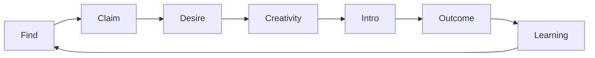

# Sleptons: An AI-Native Production Factor Allocation Network

> Let every factor of production — talent, creativity, trust, information, capital, ideas, power, desires, needs, stories, and everything in between — flow to the place on earth most suited to it, at an efficiency never before seen.

> “This era has never rewarded the extraordinary so richly, or punished the ordinary so harshly.” — LatePost [24]

Sleptons, 超对称轻子计划, is an attempt to build that flow as infrastructure. This essay uses Nebutra’s nine-layer founder stack: essence, future, principles, strategy, product, user, expression, identity, and execution. For an AI-native category, Category, Narrative, and the North Star that measures real output have to move earlier. [1]

:::takeaways How to read this
- Evidence: government statistics, international organizations, papers, industry reports, and public product practice. It tells us whether the problem is real.
- Interpretation: how Sleptons reads that evidence. It can be revised.
- Bets: the hypotheses we will test with product and operating results. Outside research can prove a problem is worth solving. It cannot pre-prove that Sleptons will solve it.
:::

This document is therefore both a story and a set of propositions waiting to be verified.

## The missing meeting

The world produces unused possibility every day.

A person with unusual creative force can go years without meeting anyone who understands them. A founder spends six months in Beijing looking for a cofounder, while someone two kilometers away is waiting for the same opening. An excellent engineer is not job-hunting. He is just spending more nights on robots, hackathons, and open source. A robotics startup has been looking for that person for three months.

A young person writes down a strange idea and never gets the missing piece — engineering, product, capital, distribution, or a trusted collaborator. The idea dies in a notes app. A project has technical depth and no one who can explain it. An investor is hunting a very specific founder. That founder already exists, just not in the investor’s feed.

What they lack is often not ability, and not resources as such.

> They lack the right factors of production meeting at the right time.

We already have mature markets for capital, goods, advertising, and logistics. Capital can cross a planet in hours. A package can arrive at a specific door. An ad platform can estimate the chance that someone will buy a pair of shoes.

Talent, ideas, desire, trust, opportunity, and organizational relationship still move through résumés, keywords, group chats, a friend’s introduction, a conference you almost skipped, and the sentence:

> “I happen to know someone.”

That inefficiency is no longer a private inconvenience. It is a structural contradiction.

China’s 2026 college graduating class is expected to reach 12.7 million. Researchers at the Development Research Center of the State Council describe the core employment problem as a structural mismatch across major, skill, credential, role, and expectation: people without work, and work without people, at the same time. [2]

The world is not short of entrepreneurial impulse. GEM’s 2025/2026 global report finds record early-stage activity in many regions, and a widening Survival Gap as new firms fail to become stable companies. [3]

The picture is getting clearer.

> We have more talent, ideas, capital, and founding attempts than ever, and still no allocation system efficient enough for them.

Sleptons begins there. It wants a living map of people, capability, desire, ideas, trust, projects, organizations, capital, opportunity, and outcomes. It tries to learn what someone has actually made, what they are unusually good at, who will trust them, what they are becoming obsessed with, what future they can already see, where they want to go next, who would amplify them, which factor an idea still lacks, which opportunity should appear in front of whom, and which combinations later created real value.

It starts by finding one person. Then two people meet. An idea finds its builder. A group becomes a team. A team becomes a project. A project becomes a company. The company finds talent, customers, stories, channels, and capital. Capital sees a future earlier.

Until one day a person only has to say:

> “This is what I want to make.”

And the factors most able to help it happen begin to move toward it.

FIGURE:allocation-loss

## Why now: seven structural signals

### 1. Employment is shifting from “is there a job?” to “is this person in the right place?”

Chinese graduate employment is under both volume pressure and structural mismatch. The people industry needs, the people education is producing, the people the young want to become, and the people companies will pay for do not automatically coincide. [2]

More job listings will not finish the problem. The hard questions are: in which organization, project, and stage does this person create the most value? Which opportunity is worth changing a life path for? Which capabilities has the market failed to price?

Talent allocation is not an information-publishing problem. It is a problem of understanding and combination.

### 2. Founding is active. Most ideas never cross the Survival Gap.

GEM surveyed 53 economies and more than 160,000 people. It records record founding activity and a weak conversion from early firms into mature ones: the Survival Gap. [3]

WIPO’s Global Innovation Index 2025 shows innovation investment recovering in places, overall growth at a historic low, venture deal counts still falling, and a remaining distance between technical progress and large-scale adoption. [4]

The surface contradiction is simple. More people want to found. More projects appear. AI makes prototypes faster. Stable organizations, products, customers, and industries remain scarce.

Society is not short of ideas. Ideas are short of the right team, patient capital, early customers, a credible narrative, and the ability to stay organized.

Sleptons names this the **Creativity-to-Organization Gap**.

### 3. Capital is still large. Discovery, concentration, and exits are the new bottlenecks.

“The rich are getting poorer” does not match the data. UBS reports global billionaire wealth at a record $15.8 trillion in 2025, with a new generation of self-made wealth still being created. [5]

What changed is structure. US 2025 venture dollars concentrated in AI and a few mega-rounds. NVCA data put AI at about 65% of US venture dollars, with five companies raising nearly $60 billion, while exits and fundraising stayed in crisis and first-time funds hit their lowest count since 2007. [5]

China faces the same pressure on fundraising and exits. Public figures put 2024 newly raised private-equity funds at about RMB 1.44 trillion, down 20.8% year on year. Policy language has shifted toward patient capital, higher tolerance for failure, and clearer exits. [6]

Capital’s problem is not absolute shortage.

> How do you recognize the next people, ideas, and organizations worth a long allocation before consensus forms? How do you move capital from crowded consensus toward a future that is still mispriced?

That is now a shared question for venture, family capital, and industrial capital.

### 4. Weak social mobility is also weak talent discovery and opportunity exposure.

OECD describes sticky floors and sticky ceilings: the bottom struggles to rise, the top keeps opportunity. The World Bank’s intergenerational mobility database shows a stable link between inequality and mobility. [9]

Mobility is not only ability. It is whether someone has seen a profession, met a certain kind of person, received an early chance, learned that another path exists, and found someone willing to give a first credible endorsement.

A study of 1.2 million US inventors found that children from high-income families become inventors at much higher rates than children from lower-income families, even with similar childhood math scores. The researchers called those who never entered the right environment Lost Einsteins. [8]

> Many potentials did not fail. They never received an entrance.

A system that lets more people meet the right team, idea, role model, and chance earlier is not only a recruiting tool. It can become a new mobility path.

### 5. The old life script no longer explains everyone. New desires still lack an organization.

For decades a common path read: education, stable job, property, marriage, family, status. The path still works for some. It is no longer the only answer.

In 2025, Chinese real-estate development investment fell 17.2% year on year, and residential sales volume and value kept falling. [10]

Marriage is being renegotiated. National marriage registrations were 6.106 million couples in 2024 and 6.763 million in 2025. A rebound is not a reversal. Timing, cost, meaning, and the relation to other life goals are all in motion. [11]

“Lying flat” remains a researched social fact. The literature does not treat it as one psychology. It can be withdrawal after overload, or a temporary recovery of autonomy. Reviews find both positive and negative mental-health associations. [12]

The accurate reading is not “humans ran out of desire.”

> The unified desire narrative is splitting.

People still want wealth, autonomy, making, belonging, status, influence, risk, expression, spiritual meaning, and a long residue. Desire is still there. It is scattered in private minds, without infrastructure that lets it be said, understood, combined, and paid.

### 6. People who take non-consensus risk need matching upside.

Founders are not one motive. GEM’s cross-country work shows mixed motives: wealth, autonomy, social problems, family business, and income when jobs are scarce. [14]

Self-Determination Theory treats autonomy, competence, and relatedness as basic psychological needs for effective action. [13]

A society that can keep innovating has to offer economic return, room to act, skill growth, peer recognition, social effect, identity, and a way back in after failure.

Experiments find that tolerating early failure and rewarding long-term success produces more exploratory innovation than rewarding only short-term performance. Other experiments find that decision-makers still prefer low-risk options even when high-risk projects have larger potential payoffs. [15]

> People who take real non-consensus risk should, if they succeed, receive financial, reputational, and spiritual return that matches the risk.

Non-consensus value has to be proven by long work and final results. If every institution only pays for short-term certainty, edge innovation rarely becomes industry.

### 7. Search, relationship, and verifiable proof are already appearing as infrastructure.

a16z has described a long-built “who is who in tech” dataset and high-trust network, now being moved by software and AI, with hiring as the first obvious application. [18]

Exa already offers natural-language people search over billion-scale professional profiles. [19]

Dex matches on motive, ambition, and hard no’s. Cedar uses hiring as a wedge and tries to turn trusted work relationships into an AI-native professional network. [20]

W3C Verifiable Credentials, digital identity wallets, and zero-knowledge proofs are making it possible to prove a qualification while disclosing only what the moment needs. [21]

These are not the destination.

> People search, desire understanding, trust networks, and verifiable identity are converging from isolated features into a new infrastructure direction.

Sleptons’ opportunity is not to copy any one of them. The bet is to put capability, ideas, desire, trust, opportunity, and outcomes into one network that keeps learning.

FIGURE:why-now

## L1 · Essence

### Why Sleptons should exist

A great deal of wealth is never created because two people who should have met did not, an idea never found its builder, a problem never met someone willing to take the risk, complementary people never entered the same room, a unit of capital never saw the project that fit it, or a person with large potential never entered the right environment.

Call that **Allocation Loss**.

Talent allocation is not a metaphor. Hsieh, Hurst, Jones, and Klenow estimate that, in their US 1960–2010 sample and model, better talent allocation can explain 20–40% of per-capita market-output growth. The number does not transfer to every country. It is enough to show that putting people into positions closer to comparative advantage can have macro scale. [7]

> The next important productivity jump will not only come from making more factors. It will come from putting existing factors into better combinations.

**Mission.** Help every factor of production find its place, combination, and direction faster.

**Core belief.**

- Capability determines what can be done.
- Creativity imagines what could exist.
- Desire determines what people will move for.
- Trust makes cooperation possible.
- Resources accelerate what deserves to exist.
- Outcomes teach the network what actually works.

> Creativity imagines. Desire moves. Trust unlocks. Resources accelerate. Outcomes compound.

Sleptons does not decide a life. It has four duties: make invisible possibility visible; explain why a connection is worth making; lower the cost of trust and first cooperation; and bring real outcomes back so the next allocation is sharper.

The system provides a map. The person chooses the direction.

:::insight Allocation Loss
Unused talent, unused ideas, and unused trust are not “soft” losses. They are production that never entered combination. Sleptons exists to shrink that loss.
:::

## L2 · Future

### 2036

A person who has just felt the first pull of a company opens Sleptons and says: I want a household robot that can actually enter ordinary homes. I understand product, not mechanics. I need a hardware engineer with obsession, and a designer who understands consumer products. I want the people who, seeing this idea, will feel they should be in it.

The system does not return two thousand résumés. It asks what capability structure the idea needs, what temperament and risk appetite, who has been moving this way for years, who might change their plan because of this idea, and where latent trust already exists.

The next day there are three people. One in Shenzhen has shipped two generations of consumer hardware and spent the last six months in robot open source. One has just turned down three high-salary offers because they want a real founding attempt. One in Tokyo is a designer who never searched for a China startup and has watched household robots and human-machine relations for years.

Four people meet. An idea that lived in one mind becomes a future four people believe. Six months later they incorporate. A year later they need a supply-chain lead, first beta users, a Japan channel, and financing. Funds that have watched the problem for twelve months can already see how the team formed, how it worked, and how it kept promises.

Ten years later Sleptons does not only keep a success story. It keeps an evolution path: how the idea appeared, who believed first, who gathered, which contributions became trust, which capital entered when, which combinations failed, and which ones changed the world.

The next time a similar idea appears, the network already knows more about what is worth happening, and how to make it easier.

FIGURE:future-2036

### 2036 BHAG

By 2036: a global high-quality factor network; more than **100 million** understandable nodes of people, ideas, projects, organizations, and opportunities; more than **10 million** verified high-value connections; at least **100,000** teams, projects, companies, or long collaborations formed because of those connections; millions of unrealized ideas finding a missing participant or resource; compounding Capability, Creativity, Desire, Trust, and Outcome graphs; and Sleptons as important infrastructure for builders, founders, companies, capital, and creators looking for one another.

The only long question that matters:

> How much value that would not have happened, happened because of Sleptons?

:::takeaways If the network works
- Person: life chance depends less on birthplace, school, old circle, and fluency.
- Organization: less time to find key people, form a team, and enter a new field.
- Capital: earlier signals on people, ideas, collaboration, and execution, before consensus.
- Society: fewer Lost Einsteins, higher utilization of talent and ideas, a new mobility path.
- Sleptons: revenue moves from search, to matching, to organization infrastructure, to company formation, to long ownership.
:::

## L3 · Principles

FIGURE:principles

:::steps How we see people, ideas, and connection
- Desire Matters: A résumé records where someone has been. Desire describes where they might go. Desire is a moving variable, not a personality stamp.
- Creativity Is a First-Class Asset: An idea without a company still has value. Sleptons asks not only “Who are you?” but “What do you see that does not exist yet?”
- Evidence Builds Reality: Prefer what someone made, stayed with, promised, finished, and what peers can verify. School and title are signals. Work and results are the fuller reality.
- Trust Is Capital: Every introduction spends or compounds reputation. Recommending a person means: these two are worth each other’s time.
- Non-Consensus Deserves Asymmetric Upside: Whoever takes the era’s non-consensus risk should be able to watch edge work converge into industry — and be paid if they were right.
- Agency Belongs to the Person: Claim, correct, hide, delete, refuse, choose disclosure. The system may judge. The judgment must be explainable, correctable, and exit-able.
- Outcomes Teach the Network: Did they talk, collaborate, ship, join, cofound, raise, survive, still want to work together in three years? Match → Interaction → Outcome → Learning.
:::

### Talent density

High talent density is not a room full of elite credentials. It is an organizational state:

> Complementary people, bound by shared desire and enough trust, doing high-quality work with low coordination friction.

A working heuristic, not an academic law:

> Talent density = complementary capability × shared desire × mutual trust × execution evidence ÷ coordination friction

Team-assembly research shows that how a team is formed changes the collaboration network and later performance. Teams have to balance experience, new ties, specialization, and coordination cost. [17]

Structural-hole research shows that people who span otherwise separate groups see options others cannot see, and are more likely to produce ideas others later call good. [16]

So density needs two tensions at once: strong local trust, and a continuing crossing of circles. Sleptons looks for that tension.

### Proof of Contribution

Bitcoin’s proof-of-work is only a metaphor here: work already spent makes history expensive to rewrite. [23]

Sleptons does not mine people. It records **Proof of Contribution** and **Proof of Persistence**: who proposed, who prototyped, who solved the hard part, who kept the promise in the ugly phase, who endorsed whom, who helped a team over a threshold, and what finally happened.

A person cannot be reduced to workload. Promises, contribution, and results can leave a verifiable trail. When an edge direction becomes industry, resources can flow back along that trail to the people who did the early real work and stayed.

FIGURE:contribution

## L4 · Strategy

FIGURE:category

**Long category.** Production Factor Allocation Network.

**Mid category.** Human & Creativity Allocation Network.

**First-stage category.** People Intelligence Network.

**Positioning.** For people who can say “I need this kind of person” or “I have this idea; who is missing?” and cannot find the answer:

> Sleptons is a network that discovers, understands, and connects high-value people, ideas, and opportunities.

The market has already proved four demands: natural-language people search (Exa) [19]; motive beyond the résumé (Dex) [20]; software for trusted work graphs (Cedar) [20]; and AI that can mobilize a long high-trust network (a16z) [18].

Those products prove demand. They also draw Sleptons’ boundary.

> People search is the door. Allocation results are the destination.

Ordinary search asks: who is qualified? Sleptons gradually asks: who should meet whom, around what idea, at this moment, and why?

### Cold start: Sleptons Radar

Phase one does one thing.

> Find a person the user did not know, and immediately wants to meet.

A user can type: a young Beijing builder who has independently shipped an agent product, has taste and public work, and may want to found. Or: an AI hardware idea for older adults; find people who might actually join. Or: people who have spent two years on embodied intelligence, have engineering artifacts, have not founded yet, and are visibly changing direction.

Radar does not wait for the market to register. It first understands the public world that already exists.

> Index → Search → Claim → Desire & Creativity → Intro → Outcome

Index the world, then invite the world in.

The first local network is small and dense: **AI-native builders × early founders × creativity × hackathons**. Public work, ongoing making, openness to collaboration, agency, frequent new ideas, and a real need for key people.

FIGURE:radar

### Moat

1. **Capability Graph** — what someone has actually done, which combinations are rare.
2. **Creativity Graph** — what they are thinking, which problems appear independently, what an idea still needs.
3. **Desire Graph** — what they will move for, found, join, relocate for.
4. **Trust Graph** — who knows whom, who has shipped together, whose introductions stay good.
5. **Outcome Graph** — what happened after the meeting. This is the asset that gets harder to copy with time.
6. **Private Liquidity** — “If this opportunity appears, find me.” Most of that supply never enters a public market. With permission, it can still move.

FIGURE:five-graphs

### Business model

Revenue should mature with the network.

| Layer | What is sold |
| --- | --- |
| Intelligence | Search, research, and discovery for companies, founders, and investors |
| Matching | Key talent, cofounders, advisors, and search-on-outcome |
| Network infrastructure | Hackathons, startup camps, universities, incubators, developer communities |
| Company formation | Push latent companies into existence; fee, equity, or long partnership |
| Capital allocation | Connect projects to fitting capital; funds, carry, co-invest |
| Ownership | Bind long revenue to the new value the network caused |

Search revenue → transaction revenue → ownership revenue.

:::takeaways Four strategic bets
- Public signal is enough to start: high-quality public information already produces the first discovery value. The whole market does not have to register first.
- Accuracy earns the claim: when the system understands someone accurately, they will claim the page and add real desire and ideas.
- Introductions produce evidence: high-quality introductions produce outcomes that can be followed, and therefore an Outcome Graph.
- Rails unlock private supply: when trust, credentials, and privacy rails mature, unpublished people and opportunities become Private Liquidity.
:::

## L5 · Product

Sleptons is six acts.

**Find.** A founder describes a person they wish existed, including people who are not job-hunting. The system returns a few people, each with why this person, what they actually made, and why now. The first value is: this person really exists.

**Claim.** A builder finds a page that already holds work, research, open source, collaborations, and public speech. They claim it, and start explaining themselves.

**Desire.** Not “what is your title?” — “what do you actually want to happen?” Cofounder, founding, early company, hackathon, side project, research partner, investment, advising, customers, a new city, the next step, a certain field, someone interesting.

**Creativity.** “What are you thinking about?” An unsolved problem, a half-idea, a product sketch, a research line, a future judgment, a sentence that begins *if only this existed*. The system asks what the idea still lacks. One day another person has the missing piece. The idea starts to move.

**Intro.** A is looking for a kind of person. B is looking for a kind of life. C has an idea. D has the missing capability. Sleptons says **You should meet**, and says **why**. Connection starts only after both accept. An introduction is not an impression. It is a explained trust act.

**Outcome.** Three months later: what happened? A talk, a friendship, a hackathon team, a side project, a hire, a cofounder, a launch, first users, a commercial partnership, a check, a long relationship, or a stop. Success and failure both enter the Outcome Graph.

FIGURE:flywheel

### Trust Passport

The trust layer does not require a public life. A person can prove employment, a project, a hackathon, a credential, a role, an endorsement, or a threshold, and disclose only what this connection needs.

W3C Verifiable Credentials already support selective disclosure and zero-knowledge proofs: prove a condition without revealing the raw value. The EU digital identity wallet lists storing and sharing education credentials for job search as a scene. [21] [22]

> One of the highest-leverage social uses of ledgers and zero-knowledge proofs is portable, verifiable, minimized trust.

Product rule: **Credential first, ledger optional, zero-knowledge when necessary.**

W3C is explicit: verifiable does not mean the claim is true. It means origin, integrity, and status can be checked. Issuers still have to be judged. [22]

Cryptography proves integrity. Governance builds truth: trusted issuers, revocation, user authorization, appeals, issuer reputation, minimum disclosure, and hard protection of sensitive data.

### Product matrix

These are not nine platforms. They are projections of one factor network.

| Application | What gets allocated |
| --- | --- |
| Super-individual OSINT / Radar | World → person |
| Founder match | Founder ↔ founder |
| Idea discovery and teaming | Creativity ↔ talent |
| Hackathon publish, organize, match | Builder ↔ builder ↔ idea ↔ project |
| Company role ↔ talent | Organization ↔ talent |
| Builder community | Talent ↔ idea ↔ information ↔ trust |
| AI search | Need ↔ private talent |
| Unicorn incubation | Talent ↔ idea ↔ customer ↔ organization |
| Project ↔ VC | Project ↔ capital |

Shared substrate: People, Capability, Creativity, Desire, Trust, Opportunity, Outcome.

## L6 · Users

The first user is someone who can already describe what they need, and cannot point to where the answer lives.

FIGURE:personas

:::faq First personas
- The Seeker: Founder, hiring manager, project lead, hackathon captain, investor, research lead. “I know the person. Keywords cannot find them.” They contribute demand.
- The Builder: Real work, unusual capability mix, not necessarily on the market. They need not to miss the chance that is worth a life turn. They contribute capability and desire.
- The Creator: They can see a thing that does not exist yet. The idea may have no team, company, plan, or round. They contribute creativity.
- The Organizer: Hackathons, camps, incubators, universities, corporate innovation, developer communities. They already have people. The hard part is better combination. They contribute density, interaction, and outcomes.
- The Company: High-value roles need fewer extra applications and more people who never applied and would fit. They contribute need, environment, capital, and outcomes.
- The Capital: Enters when the network has enough people, ideas, teams, and projects. They want forming ideas, gathering people, abnormal collaboration signals, and pre-financing companies worth knowing. They contribute capital and conviction.
:::

**Cold-start ICP.** High-urgency seekers for whom a wrong match is expensive; high-signal builders with public work who will take a few excellent chances; high-density organizers who can produce teaming, review, and outcome data in a short window.

Those three make the first local liquidity.

## L7 · Expression

AI, open source, cloud, global supply chains, and digital distribution are lowering the cost of making. A small team can do what used to need a large organization.

The new scarcity is finding people worth making with, ideas worth realizing, and the moment when they should combine.

Desire did not vanish. It lost a single coordinate. Property, marriage, credentials, stable jobs, and organizational power used to explain a life. They still exist. They no longer explain everyone.

A so-called low-desire society is often weaker causality between effort and result, traditional returns that no longer cover the cost, new desires without social recognition, no path to say or realize a new goal, invisible risk worth taking, and collaborators trapped in separate circles.

Sleptons does not manufacture desire. It lets existing desire be expressed, understood, connected, verified, and paid when it creates value.

> Whoever is willing to bet on and carry the era’s non-consensus may watch edge innovation converge into industry.

Early movers face thin information, social incomprehension, scarce resources, identity risk, career risk, and long uncertainty. Their value is not only seeing early. It is doing real work before consensus, and not leaving too soon. When the turn comes, resources flow toward people who already built a working path. Structural-hole theory is the older name for that position. [16]

Sleptons wants to find those holes on purpose, then let people find people, ideas find teams, projects find customers, and capital find a future.

**A new social contract.** Real making should be seen. Long contribution should be verifiable. Risk should have matching upside. Failure should not permanently lock the next entrance. Opportunity should not only travel along class and acquaintance. People should keep final control of their data, desire, and identity. New value the system creates should return to the people who made it.

FIGURE:tagline

> Every great thing begins with the right things meeting.

**Taglines.** Put potential in motion. Describe the person you wish existed. Describe what you wish existed. You should meet. Everything, where it belongs.

**Fifteen seconds.** Sleptons is an AI-native production-factor allocation network. It starts with people and ideas, learns real capability, desire, creativity, and trust, and helps meetings that would not have happened find each other.

**One sentence.** Sleptons helps the right people, the right ideas, and the right resources meet earlier.

## L8 · Identity

The name comes from physics. In supersymmetry, a slepton is the hypothetical partner of an electron, muon, or tau. [25]

The useful metaphor is not a physics claim.

> Things that look independent may have an undiscovered correspondence.

A person may have a cofounder. An idea may have a builder. A team may have one member who changes its path. A project may have capital that actually understands it. A need may have a solution that has not appeared. Those pairs are latent. Sleptons tries to develop the film.

**Archetype.** Sage first: see structure in people, ideas, relationships, trajectories, and behavior. Magician second: make combinations that existed only in possibility actually happen.

**Voice.** Intelligent without showing off. Romantic and exact. Mysterious, with every important judgment traceable. Large ambition, restrained speech. Belief in agency, and in better allocation. Imagination about the future, reverence for results.

**Visual world.** Points, trajectories, connections, fields, constellations, emergence, flow. A person is a node with a path. An idea is a node. A meeting is an edge. A gathering becomes a field. Teams and companies become constellations that form, split, and evolve. The brand should feel like a map slowly appearing behind the world.

**Expression discipline.** Tell real people, real ideas, and real results. Support era claims with evidence. Keep evidence, interpretation, and bets distinct. Keep a person’s complexity above any system label. Sleptons does not sell certainty. It makes worth-exploring possibility visible.

## L9 · Execution

One operating line: Find → Claim → Desire → Creativity → Intro → Outcome.

FIGURE:roadmap

:::timeline From day one
- 0–30 days: Ship Radar 0.1. Prove we can find people others cannot. Target Successful Discovery Rate ≥ 50%. 3,000–10,000 high-signal builder profiles. 100 real complex searches. 50 successful discoveries.
- 30–90 days: Claim, “What do you want?”, “What are you thinking about?”, Request Intro. 500 claimed profiles, 300 real desires, 200 creativity signals, 200 intro requests, ≥35% accept, 50 later outcomes, first “we would not have met” stories.
- 3–6 months: Sleptons Hackathon as a relationship-and-creativity densifier. Startup talent pilots. Idea-to-team pilots. 2,000+ claimed builders, 500+ intros, 200+ verified outcomes, paid results.
- 6–12 months: The system starts saying You should meet. 5,000+ claimed users, 1,000+ verified productive connections, first durable revenue, a working flywheel from search to better next match.
:::

**North Star: Verified Productive Connections.** A connection enters VPC if it becomes real collaboration, idea progress, a project, a hackathon team, a long peer relationship, a hire, a cofounder, advising, a commercial or customer relationship, an investment, a new company, or other lasting value both sides confirm.

DAU, signups, and search volume can be watched. They are not the value.

> How many high-value combinations happened that would not have happened.

**Second metric: Activated Creativity.** An idea received at least one previously missing factor because of Sleptons, and entered a new execution stage.

| Hypothesis | How we test it |
| --- | --- |
| Radar finds people ordinary search misses | SDR, save rate, post-search interviews |
| People will claim and correct a page | Claim rate, profile completion |
| People will state real desire | Desire completion and update rate |
| Ideas can be nodes | Creativity activation rate |
| Explained intros get accepted | Intro accept rate |
| Connections produce real results | VPC rate |
| Outcomes can be collected | 30 / 90 / 180 day follow-up |
| Demand will pay | Conversion, ACV, renewal |
| Network value grows with scale | Incremental productive connections per new node |

Every outcome follow-up also asks the counterfactual: **would this have happened without Sleptons?** That question decides whether we created new value or recorded a relationship that already existed.

:::steps Continue or kill
- Radar: keep going if SDR holds at 50%, users can say why old search failed, some users search again, and human cost falls as the index matures.
- Claim and Desire: keep going if discovered people claim, correct, keep updating desire, and desire measurably improves match quality.
- Intro: keep going if accept rate is sustainable, outcomes are verifiable, users keep giving Sleptons high-value chances, and spam is controlled.
- Company formation: enter only after repeated high-quality team formation, visible gaps, stable idea-to-team results, customer proof, and clear ownership.
:::

### Governance

The long risk is as large as the long value. Public information still needs minimization, purpose limits, authorization, and deletion. The system must watch whether school, company, gender, region, and existing reputation suppress potential. The network should reward both high-quality trust and cross-circle ties, or it will only digitize current power. Prefer evidence and match explanations over a single permanent personality score. Credentials need issuer, expiry, revocation, and scope. Contact details stay protected; introductions need both sides. Recruiting, search, funds, and investment advice follow local licensing. The system discovers and explains. The person chooses.

### The long route

Year 1 is people and creativity. Year 2 is teams. Year 3 is companies. Then capital, markets, and a production-factor layer.

a16z showed one strong form: concentrate capital, talent, information, brand, trust, content, and operations, then allocate them densely to a few companies. [18]

Sleptons wants to test whether that capability can be software, network, and AI-native, and serve a much wider set of people and ideas. Capital is not the only door. Talent is not a static résumé. An idea is not an attachment to a pitch. Trust is not an invisible background variable. Desire is not noise.

A great network does not have to own the most resources. It has to make it easier for the world’s resources to enter the right combination.

## What success looks like

On day one a user says: help me find a person. Later: help me find my cofounder. Later: I have an idea; find the people who can make it. Later: help me form a team. Later: this is the company I want. Finally: this is the future I want to make.

One day they may not have to ask. Sleptons will say: there is someone you should meet. There is an idea you might like. There is a team that needs what you have. There is a problem that fits the last five years of your path. There is a chance that may be worth changing the plan.

Some introductions will come to nothing. Some people will become friends. Some will finish a weekend project. Some ideas will fail. Some will become products. Some will become companies. A few companies will change an industry. A few meetings may change an era.

Those few are what the Sleptons Project is worth a decade of looking for.

Most large human value began with something ordinary:

> The right people, the right idea, and the right resources finally met.

Sleptons exists so those meetings happen earlier, more often, more accurately, and anywhere on earth.

> Put potential in motion.

> Everything, where it belongs.

## References

1. [Nebutra, The Nine-Layer Founder Design Stack](https://nebutra.com/blog/founder-top-design-nine-layers)
2. [Qian Cheng, structural mismatch in graduate employment, 2026](https://tyjrswj.beijing.gov.cn/fwzl/jycy/202605/t20260518_4655832.html)
3. [GEM 2025/2026 Global Report](https://www.gemconsortium.org/reports/latest-global-report)
4. [WIPO, Global Innovation Index 2025](https://www.wipo.int/web-publications/global-innovation-index-2025/en/gii-2025-at-a-glance.html)
5. [UBS Billionaire Ambitions Report 2025](https://www.ubs.com/global/en/media/display-page-ndp/en-20251204-billionaire-ambitions-report-2025.html)
6. [NDRC / Economic Daily on venture fundraising and exits, 2025](https://myjj.ndrc.gov.cn/zth/xcbd/202504/t20250403_1397033.html)
7. [Hsieh, Hurst, Jones, Klenow, The Allocation of Talent and U.S. Economic Growth, Econometrica 2019](https://ideas.repec.org/a/wly/emetrp/v87y2019i5p1439-1474.html)
8. [Bell, Chetty, Jaravel, Petkova, Van Reenen, Who Becomes an Inventor in America?, QJE 2019](https://academic.oup.com/qje/article/134/2/647/5218522)
9. [OECD, A Broken Social Elevator?](https://www.oecd.org/en/publications/broken-elevator-how-to-promote-social-mobility_9789264301085-en.html)
10. [NBS, 2025 national real-estate market](https://www.stats.gov.cn/sj/zxfb/202601/t20260119_1962324.html)
11. [CNR, 2024 marriage registrations 6.106 million couples](https://news.cnr.cn/native/gd/20250730/t20250730_527291791.shtml)
12. [Ren et al., scoping review of “lying flat” and mental health, 2026](https://www.frontiersin.org/journals/psychology/articles/10.3389/fpsyg.2026.1681347/full)
13. [Self-Determination Theory](https://selfdeterminationtheory.org/theory/)
14. [GEM on entrepreneurial motivations](https://www.gemconsortium.org/news/why-policymakers-need-to-understand-the-motivations-of-entrepreneurs)
15. [Ederer and Manso on innovation incentives](https://pubsonline.informs.org/doi/10.1287/mnsc.2013.1765)
16. [Burt, Structural Holes and Good Ideas, AJS 2004](https://www.journals.uchicago.edu/doi/abs/10.1086/421787)
17. [Guimerà, Uzzi, Spiro, Amaral, Team Assembly Mechanisms, Science 2005](https://pmc.ncbi.nlm.nih.gov/articles/PMC2128751/)
18. [a16z, New Media, One Year In, 2026](https://a16z.com/what-is-new-media-in-2026/)
19. [Exa People Search](https://exa.ai/docs/reference/verticals/people)
20. [a16z Speedrun, Dex](https://speedrun.a16z.com/companies/dex)
21. [W3C Verifiable Credentials Data Model 2.0](https://www.w3.org/TR/vc-data-model-2.0/)
22. [W3C: verifiable is not the same as true](https://www.w3.org/TR/vc-data-model-2.0/)
23. [Nakamoto, Bitcoin, 2008](https://bitcoin.org/bitcoin.pdf)
24. [LatePost via Tencent News, 2026](https://view.inews.qq.com/a/20260622A0EUAQ00)
25. [ATLAS / CERN on sleptons](https://atlas.cern/Updates/Briefing/searching-electroweak-susy)
