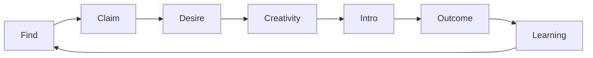

# 超对称轻子计划：AI 原生生产要素配置网络

> 让人才、创意、信任、信息、资本、想法、权力、欲望、需求、故事，以及一切尚未被命名的生产要素，以前所未有的效率，流向世界上最适合它的位置。

> “这个时代对非凡的奖励从未如此丰厚，对平凡的惩罚从未如此严厉。” ——《晚点 LatePost》[24]

Sleptons，超对称轻子计划，是一次把这种流动做成基础设施的尝试。这篇企划沿用 Nebutra Founder 顶层设计九层：从本质、未来、原则，推到战略、产品、用户、表达、身份与执行。对 AI 原生新品类，Category、Narrative，以及衡量有效产出的北极星指标，必须提前处理。[1]

:::takeaways 阅读说明
- 事实：来自政府统计、国际组织、论文、行业报告与公开产品实践。它说明问题是否真实存在。
- 推论：Sleptons 对这些事实的解释，以后可以被修正。
- 押注：准备用产品和经营结果去验证的假设。外部研究能证明问题值得解决，却不能预先证明 Sleptons 一定能解决。
:::

因此，这既是一份故事，也是一组等待被验证的命题。

## 缺席的相遇

世界每天都在产生尚未实现的可能性。

一个极有创造力的人，可能多年遇不到真正理解他的人。一个想创业的人在北京找了半年联合创始人，两公里外恰好有人在等同一个机会。一个优秀工程师并没有公开求职，只是越来越频繁地研究机器人、参加黑客松、贡献开源；一家机器人创业公司已经找这样的人三个月。

一个年轻人把异常独特的创意写进备忘录，却缺工程、产品、资本、渠道或可信合作者中的某一环。一个项目有出色的技术，却没有遇见能理解、讲述并传播它的人。一个投资人在找某一种极其具体的创始人。那个创始人已经存在，只是从未出现在他的信息流里。

他们缺少的，往往不是能力，也不是资源本身。

> 他们缺少的是：正确的生产要素，在正确的时间发生正确的相遇。

人类已经建立了成熟的资本市场、商品市场、广告市场与物流系统。资本可以在短时间内跨越半个地球。商品可以被准确送到某一扇门前。广告平台可以计算一个人购买某双鞋的概率。

但人才、创意、欲望、信任、机会与组织关系，依然大量依靠简历、关键词、群聊、朋友介绍、偶然参加的一场活动，以及一句：

> “我正好认识一个人。”

这种低效率已经表现为结构性矛盾。

2026 届中国高校毕业生预计达到 1270 万人。国务院发展研究中心研究人员把主要矛盾概括为专业、技能、学历、岗位要求与就业期望之间的结构性失配：“有人没活干”与“有活没人干”并存。[2]

世界并不缺少创业冲动。GEM 2025/2026 全球报告发现，许多地区的早期创业活动达到纪录水平，但大量新企业无法过渡为稳定经营的成熟公司，形成不断扩大的“生存鸿沟”。[3]

问题逐渐清楚：

> 世界拥有越来越多人才、创意、资本与创业行动，却仍然缺少一套足够高效的配置系统。

超对称轻子计划由此开始。Sleptons 希望建立一张关于人、能力、欲望、创意、信任、项目、组织、资本、机会与结果的活地图。它逐渐理解：一个人真正创造过什么，异常擅长什么，谁愿意信任他，他正在为什么着迷，他看见了怎样尚未存在的未来，下一步真正想去哪里，什么样的人能够放大他的能力，一个创意还缺少哪一种关键要素，什么机会值得此刻出现在谁面前，哪些组合最终创造了真实价值。

它从寻找一个人开始。然后让两个人相遇。让创意找到实现它的人。让一群人形成团队。让团队形成项目。让项目成为公司。让公司找到人才、客户、故事、渠道与资本。让资本更早看见值得下注的未来。

直到有一天，一个人只需要说：

> “这是我想做的事情。”

世界上最适合帮助这件事发生的生产要素，便开始向它流动。

FIGURE:allocation-loss

## Why Now｜七个已经出现的结构信号

### 信号一：就业问题正在从“有没有岗位”转向“人是否处在正确位置”

中国高校毕业生就业同时承受总量压力与结构错配。产业需要的人、教育体系正在培养的人、年轻人想成为的人，以及企业愿意付费雇用的人，并没有自动重合。[2]

职位数量增加，并不能完整解决问题。真正困难的是：什么样的人，在什么组织、项目与阶段中，能够产生最高价值？什么样的机会，值得一个人改变原有路径？什么能力尚未被市场正确识别？

人才配置不是信息发布问题，而是理解与组合问题。

### 信号二：创业活动活跃，但大量创意无法穿过生存鸿沟

GEM 的全球调查覆盖 53 个经济体、超过 16 万名受访者。报告一方面观察到纪录级创业活动，另一方面指出早期企业向成熟企业转化不足，并将其称为不断扩大的 Survival Gap。[3]

WIPO《全球创新指数 2025》也显示，创新投资虽然在部分领域恢复，但总体增长处于历史低位，风险投资交易数量继续下降，技术进步与大规模采用之间仍然存在距离。[4]

表面矛盾是：想创业的人越来越多，新项目越来越多，AI 让原型更快，真正形成稳定组织、产品、客户与产业结构的项目依然有限。

问题并不是社会缺少 Idea。问题是大量 Idea 没有获得正确的团队、耐心资本、早期客户、可信叙事与长期组织能力。

Sleptons 把这一缺口定义为 **Creativity-to-Organization Gap：从创意到组织的鸿沟**。

### 信号三：资本依然庞大，但机会发现、集中度与退出效率成为新瓶颈

UBS 报告显示，2025 年全球亿万富豪财富达到创纪录的 15.8 万亿美元，其中新一代白手起家者仍在创造大量新增财富。[5]

真正变化的是资本结构。美国 2025 年风险投资金额高度集中于 AI 和少数超级项目。NVCA 数据显示，AI 约占美国风险投资金额 65%，仅五家公司就融资接近 600 亿美元；与此同时，退出与募资危机贯穿整个市场，首次募资基金数量降至 2007 年以来最低水平。[5]

中国市场也面临募资和退出压力。公开数据显示，2024 年中国股权投资市场新募集基金规模约 1.44 万亿元，同比下降 20.8%。政策开始强调耐心资本、提高容错率与打通退出渠道。[6]

因此，资本的问题并不是绝对数量不足。

> 如何在共识形成以前，识别下一批值得长期配置资源的人、创意与组织？如何把资本从拥挤共识引向尚未被正确定价的未来？

这也是 VC、家族资本与产业资本共同面对的命题。

### 信号四：社会流动性不足，本质上也是人才发现与机会暴露不足

OECD 将许多经济体中的社会流动描述为“黏住的地板”与“黏住的天花板”。世界银行建立的代际流动数据库也表明，收入不平等与代际流动之间存在稳定关联。[9]

社会流动性并不仅由一个人的能力决定。它也取决于：他是否接触过某种职业，是否认识某类人，是否获得早期机会，是否知道另一条路径存在，是否有人愿意为他提供第一次可信背书。

对美国 120 万名发明者的研究发现，高收入家庭子女成为发明者的概率远高于中低收入家庭子女；即使儿童时期数学成绩相似，差异依然存在。研究者把那些因缺少创新环境暴露而未能成为发明者的人称为 Lost Einsteins。[8]

> 很多潜能没有失败。它们只是从未获得进入正确环境的机会。

如果一个系统能够让更多人更早接触适合自己的团队、创意、角色模型与机会，它创造的不只是招聘效率，也可能是新的社会流动通路。

### 信号五：旧的人生脚本正在失去唯一解释力，新的欲望却尚未获得组织形式

过去几十年，一条广泛存在的人生路径是：教育 → 稳定职业 → 房产 → 婚姻 → 家庭 → 身份提升。这条路径仍然有效，但已经不再是所有人的统一答案。

2025 年中国房地产开发投资同比下降 17.2%，住宅销售面积和销售额继续下降。[10]

婚姻行为也在重构。2024 年全国结婚登记为 610.6 万对，2025 年回升至 676.3 万对。短期波动说明婚姻没有消失，但其时间、成本、意义和与其他人生目标的关系正在被重新协商。[11]

与此同时，“躺平”成为一种持续受到研究的社会现象。现有文献并未把它解释为单一心理状态：它既可能表现为压力超过阈值后的消极退出，也可能是一种暂时恢复自主性、重新调整生活的策略。综述发现，它同时可能关联正面与负面的心理结果。[12]

因此，更准确的判断不是“人类没有欲望了”。

> 统一的欲望叙事正在分化。

有人追求财富，有人追求自主，有人追求创造，有人追求归属，有人追求地位、影响、冒险、表达、精神意义与长期遗产。欲望依然存在，只是它们被分散在个人心中，缺少一种让其被表达、被理解、被组合并获得回报的基础设施。

### 信号六：承担非共识风险的人，需要与风险相匹配的上行空间

创业者并不是由单一动机驱动。GEM 的跨国调查显示，创业动机同时包含积累财富、获得自主权、解决社会问题、延续家庭事业，以及在就业机会不足时创造收入来源。[14]

自我决定理论则把自主、胜任与关系连接视为维持有效行动和内在动机的重要心理需要。[13]

这意味着，一个能够持续推动创新的社会，需要同时提供经济回报、自主空间、能力成长、同行认可、社会影响、身份与意义，以及失败后的再次进入机会。

相关实验研究发现，允许早期失败并奖励长期成功，比只奖励短期绩效更能激励探索性创新；另一些实验则发现，即使高风险项目拥有更大的潜在收益，决策者仍会系统性偏好低风险方案。[15]

> 社会需要让承担真实非共识风险的人，在成功以后获得与其风险相匹配的财务回报、声誉回报和精神回报。

非共识的价值需要由长期工作、持续学习和最终结果验证。但如果所有制度都只奖励短期确定性，边缘创新便很难成长为新的产业结构。

### 信号七：新的搜索、关系与可信证明基础设施已经出现

a16z 公开描述自己长期积累了一套关于“科技行业里谁是谁”的数据与高信任关系网络，并正在利用软件和 AI 调动这张网络；招聘只是最直接的第一类应用。[18]

Exa 已经提供覆盖十亿级职业资料的自然语言人物搜索。[19]

Dex 开始围绕候选人的动机、野心与不可接受条件进行匹配；Cedar 则把招聘作为切入点，通过员工的可信职业关系建立 AI 原生职业网络。[20]

W3C 可验证凭证标准、数字身份钱包与零知识证明，则开始为“如何证明某项资格，同时只披露必要信息”提供成熟基础。[21]

这些端倪共同说明：

> 人物搜索、欲望理解、信任网络和可验证身份正在从彼此孤立的功能，逐渐收敛为新的基础设施方向。

Sleptons 的机会不在于重复其中任何一项。它的押注是把能力、创意、欲望、信任、机会与结果，放进同一张持续学习的配置网络。

FIGURE:why-now

## L1｜本质

世界上有大量财富从未被创造。原因有时只是：两名应该认识的人没有认识；一个极好的创意没有找到合适的 Builder；一个值得解决的问题没有遇到愿意为它承担风险的人；一群彼此互补的人没有出现在同一个房间；一笔资本没有看见真正适合自己的项目；一个拥有巨大潜能的人，一生没有进入最适合自己的环境。

这些损失可以被统一理解为 **Allocation Loss｜配置损失**。

人才配置并非抽象概念。Hsieh、Hurst、Jones 与 Klenow 对美国 1960—2010 年职业配置变化的研究估计，在其模型与历史样本中，更有效的人才配置可以解释人均市场产出增长的 20%—40%。这一数字不能直接套用于所有国家，却足以说明：让人进入更符合其比较优势的位置，理论上可能产生巨大的宏观价值。[7]

> 人类下一阶段的重要生产力提升，不只来自创造更多生产要素，也来自让已有生产要素进入更优的组合。

**使命。** 让世界上的每一种生产要素，更快找到最适合自己的位置、组合与方向。

**核心信念。**

- 能力决定什么可以被完成。
- 创意想象什么尚未存在。
- 欲望决定人愿意为什么而行动。
- 信任让合作成为可能。
- 资源让值得存在的事物更快成为现实。
- 结果让网络理解什么真正有效。

> Creativity imagines. Desire moves. Trust unlocks. Resources accelerate. Outcomes compound.

Sleptons 不替人决定人生。它承担四项责任：发现原本不可见的可能性；解释为什么某种连接值得发生；降低建立信任与开始合作的成本；把真实结果带回网络，让下一次配置更准确。

系统提供地图。人决定去向。

:::insight 配置损失
未被使用的人才、创意和信任，不是“软损失”。它们是从未进入组合的生产。Sleptons 存在的理由，就是缩小这种损失。
:::

## L2｜未来

### 2036

一个刚刚萌生创业念头的人打开 Sleptons。他说：我想做一种真正能够进入普通家庭的机器人。我懂产品，但不懂机械。我希望找到一个极强的硬件工程师，一个对机器人有长期执念的人，以及一个真正理解消费产品的设计师。我想找到那些看见这个创意以后，会觉得自己应该参与其中的人。

系统没有给他两千份简历。它开始理解这个创意需要怎样的能力结构，需要怎样的人格与风险偏好，什么人过去几年一直在向这个方向移动，什么人可能因为这个创意改变原来的计划，什么人之间已经存在潜在信任路径。

第二天，他见到了三个人。第一个人在深圳做过两代消费电子硬件，过去半年开始频繁参与机器人开源项目。第二个人刚刚拒绝三份高薪 Offer，因为他越来越确定自己希望参与一次真正的创业。第三个人住在东京，是一名设计师，从未主动寻找中国创业机会，却持续多年关注家庭机器人与人机关系。

四个人见面。某个原本只存在于一个人脑海里的创意，第一次变成四个人共同相信的未来。六个月后，他们成立公司。一年以后，他们需要供应链负责人、第一批 Beta 用户、进入日本的渠道，以及融资。几家长期关注这一问题的基金已经观察这个项目十二个月，并且能够看到团队怎样形成、怎样协作、怎样履行承诺。

十年后，Sleptons 保存的不只是一条成功案例。它保存的是一条完整演化路径：一个创意如何出现，谁最早相信它，什么样的人因为它聚集，哪些贡献形成了信任，什么资本在什么阶段进入，哪些组合失败，哪些组合最终改变了世界。

下一次，当类似创意出现时，整个网络已经比上一次更加理解：什么值得发生，以及怎样让它更容易发生。

FIGURE:future-2036

### 2036 BHAG

到 2036 年：建立全球规模的高质量生产要素网络；形成超过 **1 亿个**可理解的人、创意、项目、组织与机会节点；促成超过 **1000 万次已验证的高价值连接**；让至少 **10 万个**团队、项目、公司或长期合作关系因这些连接而形成；让数以百万计尚未实现的创意找到关键参与者与资源；建立具有长期复利价值的 Capability、Creativity、Desire、Trust 与 Outcome Graph；让 Sleptons 成为 Builder、Founder、Company、Capital 与 Creator 寻找彼此的重要基础设施。

真正需要长期追踪的问题只有一个：

> 有多少原本不会发生的价值，因为 Sleptons 而发生？

:::takeaways 如果这张网络成立
- 对个人：人生机会更少受制于出生地、学校、原有圈层与表达能力。
- 对组织：降低找到关键人才、形成团队、建立信任与进入新领域的时间成本。
- 对资本：在共识形成以前，观察人、创意、合作关系与执行结果的早期信号。
- 对社会：减少 Lost Einsteins，提高人才与创意的实际利用率，形成新的社会流动通路。
- 对 Sleptons：收入结构将从搜索服务，逐步进入撮合、组织基础设施、公司形成与长期所有权收益。
:::

## L3｜原则

FIGURE:principles

:::steps 我们如何看待人、创意与连接
- Desire Matters｜欲望值得被理解: 履历记录一个人曾经在哪里。欲望描述一个人可能愿意去哪里。欲望是动态变量，而不是人格标签。
- Creativity Is a First-Class Asset｜创意本身就是生产要素: 尚未成立公司的想法仍然存在价值。Sleptons 不只理解 Who are you，也理解 What do you see that does not exist yet。
- Evidence Builds Reality｜真实创造构成真实能力: 优先观察他创造过什么、长期投入过什么、承诺过什么、最终完成了什么、哪些结果能够被外部验证。学校与职位是信号。作品与结果构成更完整的现实。
- Trust Is Capital｜信任是一种可以积累的生产资料: 每一次介绍都会增加或消耗信任。推荐一个人意味着：我们认为你们值得彼此花时间。
- Non-Consensus Deserves Asymmetric Upside｜非共识探索应当拥有非对称上行: 谁愿意押注并承担时代中的非共识，谁就有机会亲眼见证边缘创新收敛为产业结构的过程。
- Agency Belongs to the Person｜人拥有解释自己和决定人生的权利: 认领、纠正、隐藏、删除、拒绝、选择披露。系统可以提出判断，但判断必须可解释、可纠正、可退出。
- Outcomes Teach the Network｜结果让网络真正拥有智慧: 他们聊了吗，合作了吗，组成团队了吗，产品完成了吗，三年以后还愿意一起工作吗？Match → Interaction → Outcome → Learning。
:::

### 高密度人才

高密度人才不是把许多名校履历放进同一间办公室。它是一种组织状态：

> 彼此互补的人，因为共同欲望建立足够信任，并且能够以很低的协调摩擦持续完成高质量工作。

经营启发式，不是学术定律：

> 人才密度 = 能力互补 × 共同欲望 × 相互信任 × 执行证据 ÷ 协调摩擦

团队研究已经表明，创意团队如何组建，会影响协作网络结构与最终表现；团队需要在经验、陌生连接、专业分工与协调成本之间形成适当平衡。[17]

结构洞研究则指出，跨越彼此隔离群体的人，更容易接触不同思考方式与此前不可见的选择，并因此更可能提出被认可的好创意。[16]

因此，组织高密度人才需要同时完成两件事：在局部形成足够强的信任与协作密度；持续跨越圈层，引入新的信息、创意与人才。Sleptons 的作用，是寻找这两者之间的最优张力。

### Proof of Contribution

区块链中的工作量证明，只为 Sleptons 提供制度隐喻。已经投入的计算工作使历史记录难以被低成本改写。[23]

Sleptons 不复制计算挖矿，而是建立 **Proof of Contribution｜贡献证明** 与 **Proof of Persistence｜持续在场证明**。它记录：谁提出了创意，谁完成了原型，谁解决了关键问题，谁在困难阶段继续履行承诺，谁为谁提供了可信背书，谁真正帮助团队跨过临界点，最终结果如何。

人的价值不能被工作量衡量。但承诺、贡献与结果可以留下可验证的轨迹。当一个边缘方向最终成为产业结构，资源便有可能沿着这些轨迹，回流给那些最早投入真实工作并持续在场的人。

FIGURE:contribution

## L4｜战略

FIGURE:category

**长期品类。** Production Factor Allocation Network｜生产要素配置网络。

**中期品类。** Human & Creativity Allocation Network｜人才与创意配置网络。

**第一阶段品类。** People Intelligence Network｜人才智能网络。

**定位。** 对于那些能够描述“我需要怎样的人”，或者“我有一个这样的创意，我需要谁”，却不知道答案究竟在哪里的人：

> Sleptons 是一个发现、理解并连接高价值个体、创意与机会的网络。

市场已经开始证明四类需求：自然语言搜索人（Exa）[19]；理解履历之外的动机（Dex）[20]；将可信关系网络软件化（Cedar）[20]；用 AI 调动长期积累的高信任网络（a16z）[18]。

这些产品证明需求已经出现。它们也界定了 Sleptons 的战略边界。

> 人物搜索是入口，配置结果才是终点。

普通人才搜索回答：Who is qualified？Sleptons 逐渐回答：Who should meet whom, around what idea, at this moment, and why？

### 冷启动｜Sleptons Radar

第一阶段只完成一件事情：

> 找到一个用户此前不知道、看到以后立刻想认识的人。

用户可以输入：找一个北京的年轻 Builder，真正独立做过 Agent 产品，有产品审美和公开作品，而且可能对创业感兴趣。或者：我有一个面向老年人的 AI 硬件创意，找几个真正可能愿意参与的人。或者：找过去两年持续研究具身智能、拥有工程作品、尚未创业但出现明显方向变化的人。

Radar 不等待整个市场注册。它先理解已经存在的公开世界。

> Index → Search → Claim → Desire & Creativity → Intro → Outcome

先索引世界，再邀请世界加入。

第一阶段从一个高信号、高互动频率的局部网络开始：**AI-Native Builder × Early Founder × Creativity × Hackathon**。这个网络中的人通常具备可公开验证的作品、持续创造行为、对项目与合作保持开放、较高自主行动能力、频繁形成新创意，以及对关键人才和合作机会具有真实需求。

第一阶段追求：人少但密。

FIGURE:radar

### 战略护城河

1. **Capability Graph** 谁真正做过什么，哪些能力组合极其稀缺。
2. **Creativity Graph** 谁正在思考什么，哪些问题被不同的人独立发现，一个创意还需要什么。
3. **Desire Graph** 谁真正想做什么，谁愿意创业、加入早期组织、换城市。
4. **Trust Graph** 谁认识谁，谁与谁真正合作过，哪些推荐长期保持高质量。
5. **Outcome Graph** 什么样的人相遇以后发生了什么。这是整个系统随时间增长最难复制的资产。
6. **Private Liquidity** 越来越多人主动告诉 Sleptons：如果出现这样的机会，可以来找我。这些供给不会全部进入公开市场。但它们可以在获得许可的前提下流动。

FIGURE:five-graphs

### 商业模式

Sleptons 的收入结构随网络成熟而演进。

| 层级 | 出售的东西 |
| --- | --- |
| Intelligence | 企业、Founder、投资人为高质量搜索、研究与发现付费 |
| Matching | 关键人才、联合创始人、顾问、项目合作按结果收费 |
| Network Infrastructure | 为黑客松、创业营、高校、孵化器与开发者社区提供发现、组队与结果基础设施 |
| Company Formation | 主动推动潜在公司形成，并通过服务、股权或长期合作参与价值创造 |
| Capital Allocation | 将项目与适合它们的资本连接，逐步形成基金、Carry、联合投资 |
| Ownership | 长期收益与它促成的新增价值绑定 |

Search Revenue → Transaction Revenue → Ownership Revenue。

:::takeaways 四项核心战略押注
- 公开信号足以起步：无需等待所有人注册，高质量公开信息已经足以提供第一批人物发现价值。
- 理解准确才有认领：当系统准确理解一个人以后，他愿意认领自己，并补充真实欲望与创意。
- 介绍产生可追踪结果：高质量介绍产生的结果能够被持续追踪，从而形成 Outcome Graph。
- 基础设施释放暗池供给：当信任、凭证与隐私基础设施成熟以后，大量尚未公开进入市场的人与机会会形成 Private Liquidity。
:::

## L5｜产品

Sleptons 的产品分为六幕。

**Find。** 一个 Founder 输入他希望存在的那种人，包括没有公开求职的人。系统返回少数人，并回答：为什么是他，他真正创造过什么，为什么是现在。用户第一次体验到的价值是：原来这个人真的存在。

**Claim。** 某一天，一个 Builder 发现 Sleptons 已经存在自己的页面：作品、研究、开源、合作、公开表达。他认领自己，开始主动解释自己。

**Desire。** 不是“你目前是什么职位”，而是：你真正想让什么发生？寻找联合创始人、创业、加入早期公司、参加黑客松、寻找 Side Project、研究伙伴、投资、成为 Advisor、寻找客户、换一座城市、探索下一步、认识某个领域的人、遇见真正有意思的人。

**Creativity。** What are you thinking about？一个尚未被解决的问题，一个不成熟的 Idea，一段产品构想，一个研究方向，一个未来判断，一句“如果世界上存在这样的东西就好了”。系统开始理解这个创意还缺少什么。有一天，另一个人恰好拥有最缺失的一环。创意第一次开始流动。

**Intro。** A 正在寻找某一种人。B 正在寻找某一种人生。C 拥有一个创意。D 恰好拥有实现这个创意的关键能力。Sleptons 发出 **You should meet**，同时解释 **Why**。双方接受以后，连接才真正建立。介绍本身不是一次信息曝光。它是一项经过解释的信任动作。

**Outcome。** 三个月以后：聊了一次，成为朋友，组成黑客松队伍，一起做了 Side Project，加入公司，成为联合创始人，产品上线，获得第一批用户，形成商业合作，获得投资，建立长期关系，或者没有继续推进。成功与失败都进入 Outcome Graph。

FIGURE:flywheel

### Trust Passport｜可携带的信任

Sleptons 的信任基础设施不要求用户公开全部人生。它允许一个人证明曾在某个组织任职、完成过某个项目、参加过某场黑客松、获得过某项认证、在某个团队承担过特定角色、得到某位合作者的背书、达到某项资格条件，同时只披露当前连接所需要的信息。

W3C 可验证凭证标准已经支持学历等资格凭证，以及选择性披露和零知识证明：持有人可以证明自己满足某个条件，而不必公开原始信息的全部内容。欧盟数字身份钱包也把求职时存储和分享教育凭证列为明确场景。[21] [22]

> 区块链与零知识证明最有潜力的社会价值之一，是让信任可以被携带、验证和最小化披露。

产品遵循：**Credential First，Ledger Optional，Zero-Knowledge When Necessary。**

可验证凭证能够证明某项陈述确实由特定发行方签发，却不能自动证明发行方的判断一定真实。W3C 对此有明确边界：凭证的可验证性不等于其中主张必然为真。[22]

因此，Sleptons 同时需要可信发行方体系、撤销与更新机制、用户授权、申诉与纠错、发行方信誉、最小必要披露，以及对敏感信息的严格保护。

密码学负责证明完整性。治理负责建立真实性。

### 产品矩阵

它们不是彼此独立的九个平台。它们是同一张生产要素网络在不同场景中的投影。

| 应用 | Sleptons 完成的配置 |
| --- | --- |
| 超级个体 OSINT / Radar | 世界 → 人 |
| 初创创业者匹配 | Founder ↔ Founder |
| 创意发现与组队 | Creativity ↔ Talent |
| 黑客松发布、组织与匹配 | Builder ↔ Builder ↔ Creativity ↔ Project |
| 公司岗位—人才匹配 | Organization ↔ Talent |
| Builder 社区 | Talent ↔ Creativity ↔ Information ↔ Trust |
| AI 猎头 | Need ↔ Private Talent |
| 独角兽孵化 | Talent ↔ Creativity ↔ Customer ↔ Organization |
| 项目—VC 匹配 | Project ↔ Capital |

共享底层资产：People、Capability、Creativity、Desire、Trust、Opportunity、Outcome。

## L6｜用户

第一阶段的核心用户是：他已经能够描述自己需要什么，却不知道答案具体在哪里。

FIGURE:personas

:::faq 谁最先需要 Sleptons
- The Seeker｜寻找者: Founder、Hiring Manager、项目负责人、黑客松队长、投资人、研究负责人。“我知道我要什么样的人，但关键词搜不出来。”他贡献 Demand。
- The Builder｜创造者: 拥有真实作品，能力正在形成独特组合，可能没有公开求职。他真正需要的是：值得改变人生路径的机会出现时，不要错过。他贡献 Capability + Desire。
- The Creator｜创意提出者: 他看见世界上有一件东西尚不存在。创意可能暂时没有团队、公司、商业计划、融资，但它已经拥有潜在价值。他贡献 Creativity。
- The Organizer｜组织者: 黑客松、创业营、孵化器、高校、企业创新部门、开发者社区。他们已经拥有一群人。真正困难的是：怎样让这些人形成更好的组合？他们贡献 Density + Interaction + Outcome。
- The Company｜企业: 高价值岗位需要的通常不是更多申请，而是发现那些没有申请、却可能极其合适的人。企业贡献 Need + Environment + Capital + Outcome。
- The Capital｜资本: 当网络拥有足够多的人、创意、团队和项目以后进入。它希望回答：什么创意正在形成，哪些人正在聚集，哪些合作关系开始出现异常信号，哪些项目尚未融资却已经值得认识。资本贡献 Capital + Conviction。
:::

**冷启动 ICP。** 高紧迫度寻找者：错误匹配成本高，已经使用传统搜索方法却得不到满意答案。高信号 Builder：拥有公开作品、持续行为和清晰能力轨迹，并且愿意接收少量高质量机会。高密度组织者：能够在短时间内产生组队、协作、评审与结果数据的黑客松、创业营和 Builder 社区。

这三类用户共同构成第一个局部流动性网络。

## L7｜表达

过去，创造一个新组织需要大量资源。今天，AI、开源软件、云服务、全球供应链与数字分发正在降低创造成本。一个很小的团队，可以完成过去需要大型组织才能完成的事情。

因此，新的稀缺开始出现：找到真正值得一起创造的人，找到真正值得实现的创意，让它们在正确时间形成正确组合。

欲望没有消失，只是失去了统一坐标。房产、婚姻、学历、稳定职业和组织权力曾经共同构成一套具有强解释力的人生路径。今天，这套路径仍然存在，却不再能够独自解释所有人的行动。

所谓“低欲望社会”，很多时候并不是欲望彻底消失，而是：努力与结果之间的因果关系变弱；传统回报无法覆盖投入成本；新欲望无法获得社会认可；个体缺少表达和实现新目标的路径；值得承担风险的机会难以被看见；潜在合作者被困在彼此隔离的圈层。

Sleptons 的任务不是制造欲望。而是让已经存在的欲望，能够被表达、被理解、被连接、被验证，并在创造价值以后得到回报。

> 谁愿意押注并承担时代中的非共识，谁就有机会亲眼见证边缘创新收敛为产业结构的过程。

一项新的产业共识形成以前，最早行动的人通常面对信息不足、社会不理解、资源稀缺、身份风险、职业风险与长期不确定性。他们的价值不只来自“看得早”，更来自：在共识尚未形成时，交出了真实工作，并且没有过早退出。当转变发生，资源往往会流向最早建立有效通路的人。结构洞理论指出，跨越彼此隔离群体的连接者能够接触此前不可见的选项，并把这种位置转化为创意和社会资本。[16]

Sleptons 希望系统化地发现这些结构洞。然后让人找到人，创意找到团队，项目找到客户，资本找到未来。

**新的社会契约。** 真实创造应当被看见。长期贡献应当能够被验证。承担风险的人应当拥有相应上行。失败不应永久剥夺下一次进入机会。机会不应只沿既有阶层和熟人网络流动。人应当拥有对自身数据、欲望和身份的最终控制权。系统创造的新增价值，应当回流给真正参与创造的人。

FIGURE:tagline

> Every great thing begins with the right things meeting.

**主标语。** Put potential in motion. 让潜能流动起来。Describe the person you wish existed. Describe what you wish existed. You should meet. Everything, where it belongs. 让一切，去往它最应该存在的地方。

**15 秒。** Sleptons 是一个 AI 原生生产要素配置网络。我们从人才与创意开始，理解人的真实能力、欲望、创造力与信任关系，让那些原本不会相遇的人、创意、项目和机会找到彼此。

**一句话。** Sleptons 让正确的人、正确的创意与正确的资源，更早相遇。

## L8｜身份

Sleptons 取名自物理学中的 slepton。在超对称理论中，slepton 指电子、μ 子与 τ 子等轻子的假想超对称伙伴。[25]

这个名字具有一层适合本计划的隐喻：

> 世界上某些看似彼此独立的事物，也许存在尚未被发现的对应关系。

一个人可能存在最适合他的联合创始人。一个创意可能存在最适合实现它的 Builder。一支团队可能存在能够改变其轨迹的关键成员。一个项目可能存在真正理解它的资本。一个需求可能存在尚未被发现的解决方案。这些对应关系潜伏在世界之中，只是尚未显影。

Sleptons 所做的事情，就是让这些潜在对应逐渐出现。

**品牌原型。** 主原型是智者 Sage：理解隐藏在人、创意、关系、轨迹与行为背后的结构。次原型是魔术师 Magician：让原本只存在于可能性空间中的组合真正发生。

**人格。** 聪明，但不卖弄知识。浪漫，但保持精确。神秘，但每个重要判断都可以追溯。野心巨大，但表达克制。相信人的主体性，也相信更好的配置能够被发现。对未来保持想象力，对结果保持敬畏。

**视觉世界。** 点、轨迹、连接、场、星群、涌现、流动。每个人是一个拥有轨迹的节点。每个创意也是一个节点。两个人相遇形成一条边。更多关系聚集以后形成一个场。团队、项目、公司与社区，则表现为不断生成、分裂和演化的星群。整个品牌应当让人感受到：世界背后存在一张正在缓慢显影的地图。

**表达纪律。** 用真实人物、真实创意与真实结果讲故事；用证据支撑时代判断；清楚区分事实、推论与押注；让人的复杂性高于系统给出的标签。Sleptons 不贩卖确定性。它让值得探索的可能性变得可见。

## L9｜执行

执行主线只有一条：Find → Claim → Desire → Creativity → Intro → Outcome。

FIGURE:roadmap

:::timeline 从第一天开始
- 0—30 天: 发布 Sleptons Radar 0.1。证明我们能找到别人找不到的人。目标 Successful Discovery Rate ≥ 50%。建立第一批 3,000—10,000 个高信号 Builder Profile，完成至少 100 次真实复杂搜索，至少 50 次 Successful Discovery。
- 30—90 天: 上线 Claim Profile，询问 What do you want 与 What are you thinking about，并开放 Request Intro。500 个高质量 Profile 被本人认领，300 人填写真实 Desire，200 人表达至少一个 Creativity Signal，200 次 Introduction Request，接受率 35% 以上，至少 50 次连接获得后续 Outcome。
- 3—6 个月: 启动 Sleptons Hackathon，把它做成关系与创意高密度生成器。同时启动 Startup Talent Pilot 与 Idea-to-Team Pilot。2,000+ 已认领 Builder，500+ Introduction，200+ Verified Outcomes，出现真实付费结果。
- 6—12 个月: 系统第一次主动说 You should meet。5,000+ 高质量认领用户，1,000+ Verified Productive Connections，形成第一批可持续收入，验证 Search → Connection → Outcome → Better Next Match 飞轮。
:::

**北极星指标：Verified Productive Connections｜已验证生产性连接。** 一次连接只要最终产生真实合作、创意获得推进、项目成立、黑客松团队形成、长期同行关系、入职、联合创始、顾问关系、商业合作、客户关系、投资关系、新公司形成，或其他双方共同确认的持续价值，就进入 VPC。

DAU、注册量、搜索量可以观察。真正代表 Sleptons 价值的是：

> 这个世界因为我们，多发生了多少原本不会发生的高价值组合。

**第二核心指标：Activated Creativity｜被激活的创意。** 一个创意因为 Sleptons 获得至少一个此前不存在的关键生产要素，并由此进入新的执行阶段。

| 假设 | 验证指标 |
| --- | --- |
| Radar 能找到传统搜索难以发现的人 | SDR、收藏率、搜索后访谈 |
| 用户愿意认领和修正资料 | Claim Rate、资料补充率 |
| 用户愿意表达真实欲望 | Desire Completion、持续更新率 |
| 创意可以成为有效节点 | Creativity Activation Rate |
| 用户接受解释充分的介绍 | Intro Acceptance Rate |
| 连接产生真实结果 | Verified Productive Connection Rate |
| Outcome 能够被持续收集 | 30 / 90 / 180 天回访率 |
| 需求方愿意付费 | 付费转化、客单价、续费率 |
| 网络价值随规模增长 | 每新增节点带来的有效连接增量 |

每次 Outcome 回访同时询问：**如果没有 Sleptons，这次连接是否仍然会发生？** 这个反事实问题决定 Sleptons 创造的是新增价值，还是对既有关系的重复记录。

:::steps 继续投入或停止
- Radar：SDR 稳定达到 50%；用户能够明确说出传统搜索为什么找不到这些人；至少部分用户形成重复搜索；人工服务成本随索引成熟下降。
- Claim 与 Desire：被发现者愿意认领、纠正与补充；用户能够持续更新欲望；欲望信息显著改善匹配质量。
- Intro：接受率达到可持续水平；连接能够产生可验证结果；用户愿意把高价值机会继续交给 Sleptons；垃圾信息和骚扰风险得到控制。
- Company Formation：已经观察到多次高质量团队形成；系统能够识别团队缺口；Idea-to-Team 产生稳定结果；项目拥有客户验证与明确所有权结构。
:::

### 治理与边界

Sleptons 的长期风险与其长期价值同样巨大。处理公开信息仍然遵守数据最小化、用途限制、用户授权与删除权。系统必须持续检测学校、公司、性别、地区与既有声誉是否不合理地压制潜能判断。网络需要同时奖励高质量信任与跨圈层连接，避免把现有权力关系简单数字化。Sleptons 优先呈现证据与匹配解释，避免建立单一、永久、不可申诉的人格总分。所有凭证都必须同时评估发行者、有效期、撤销状态和适用范围。联系方式默认受保护，Introduction 经过双方许可。招聘、猎头、基金、投资建议与资本撮合业务，按照各司法辖区要求由具备相应资质的主体开展。系统负责发现和解释。人负责选择。

### 三年与长期

第一年是 People & Creativity。第二年是 Teams。第三年是 Companies。然后进入 Capital、Markets，最终进入 Production Factor Network。

a16z 展示了一种极强的组织形式：把资本、人才、信息、品牌、信任、内容与运营资源集中在同一网络中，然后高密度配置给少数公司。[18]

Sleptons 希望进一步验证：这种能力能否被软件化、网络化、AI 原生化，并服务于更广泛的人与创意。资本不再是网络唯一入口。人才不是静态简历。创意不是商业计划书的附件。信任不是不可见的背景变量。欲望不是噪音。

一个优秀的网络不一定拥有世界上最多的资源。它真正拥有的是：让世界上的资源更容易进入正确组合的能力。

## 项目的最终判断标准

Sleptons 的第一天，用户说：帮我找到一个人。后来他说：帮我找到我的联合创始人。再后来：我有一个创意，帮我找到能把它做出来的人。再后来：帮我组一支团队。再后来：这是我想做的公司。最终：这是我想创造的未来。

终有一天，他甚至不再需要主动提出请求。Sleptons 会告诉他：有一个人，你应该见见。有一个创意，你可能会喜欢。有一支团队，正在寻找你拥有的能力。有一个问题，与你过去五年的轨迹异常吻合。有一个机会，也许值得你改变原来的计划。

有些介绍最终什么也不会发生。有些人会成为朋友。有些会共同完成一个周末项目。有些创意会被证明不可行。有些会成为产品。有些会成为公司。极少数公司最终会改变一个行业。极少数相遇甚至可能改变一个时代。

超对称轻子计划真正值得花十年寻找的，就是这些极少数。

因为人类历史上许多巨大的价值，都起源于同一件极其普通的事情：

> 正确的人、正确的创意与正确的资源，终于相遇。

Sleptons 存在的意义，就是让这些本应发生的相遇：更早发生，更频繁发生，更准确地发生，在世界上的任何地方发生。

> Put potential in motion. 让潜能流动起来。

> Everything, where it belongs. 让一切，去往它最应该存在的地方。

## 参考来源

1. [Nebutra，《Founder 顶层设计九层》](https://nebutra.com/zh-Hans/blog/founder-top-design-nine-layers)
2. [钱诚，《“有人没活干”与“有活没人干”》，2026](https://tyjrswj.beijing.gov.cn/fwzl/jycy/202605/t20260518_4655832.html)
3. [GEM 2025/2026 Global Report](https://www.gemconsortium.org/reports/latest-global-report)
4. [WIPO《全球创新指数 2025》](https://www.wipo.int/web-publications/global-innovation-index-2025/en/gii-2025-at-a-glance.html)
5. [UBS Billionaire Ambitions Report 2025](https://www.ubs.com/global/en/media/display-page-ndp/en-20251204-billionaire-ambitions-report-2025.html)
6. [国家发展改革委转载《经济日报》：支持创业投资健康发展](https://myjj.ndrc.gov.cn/zth/xcbd/202504/t20250403_1397033.html)
7. [Hsieh, Hurst, Jones, Klenow, The Allocation of Talent and U.S. Economic Growth, Econometrica 2019](https://ideas.repec.org/a/wly/emetrp/v87y2019i5p1439-1474.html)
8. [Bell 等，Who Becomes an Inventor in America?, QJE 2019](https://academic.oup.com/qje/article/134/2/647/5218522)
9. [OECD, A Broken Social Elevator?](https://www.oecd.org/en/publications/broken-elevator-how-to-promote-social-mobility_9789264301085-en.html)
10. [国家统计局，《2025 年全国房地产市场基本情况》](https://www.stats.gov.cn/sj/zxfb/202601/t20260119_1962324.html)
11. [央广网：2024 年全国结婚登记 610.6 万对](https://news.cnr.cn/native/gd/20250730/t20250730_527291791.shtml)
12. [Ren 等，关于“躺平”与心理健康的范围综述，2026](https://www.frontiersin.org/journals/psychology/articles/10.3389/fpsyg.2026.1681347/full)
13. [Self-Determination Theory](https://selfdeterminationtheory.org/theory/)
14. [GEM：为什么政策制定者需要理解创业动机](https://www.gemconsortium.org/news/why-policymakers-need-to-understand-the-motivations-of-entrepreneurs)
15. [Ederer & Manso，创新激励研究](https://pubsonline.informs.org/doi/10.1287/mnsc.2013.1765)
16. [Burt, Structural Holes and Good Ideas, AJS 2004](https://www.journals.uchicago.edu/doi/abs/10.1086/421787)
17. [Guimerà 等，Team Assembly Mechanisms, Science 2005](https://pmc.ncbi.nlm.nih.gov/articles/PMC2128751/)
18. [a16z, New Media, One Year In, 2026](https://a16z.com/what-is-new-media-in-2026/)
19. [Exa People Search](https://exa.ai/docs/reference/verticals/people)
20. [a16z Speedrun：Dex](https://speedrun.a16z.com/companies/dex)
21. [W3C Verifiable Credentials Data Model 2.0](https://www.w3.org/TR/vc-data-model-2.0/)
22. [W3C：可验证不等于主张必然为真](https://www.w3.org/TR/vc-data-model-2.0/)
23. [中本聪，Bitcoin, 2008](https://bitcoin.org/bitcoin.pdf)
24. [《晚点》：20 岁创始人，招 18 岁员工，被 19 岁的人投资](https://view.inews.qq.com/a/20260622A0EUAQ00)
25. [CERN ATLAS 对 slepton 的说明](https://atlas.cern/Updates/Briefing/searching-electroweak-susy)
